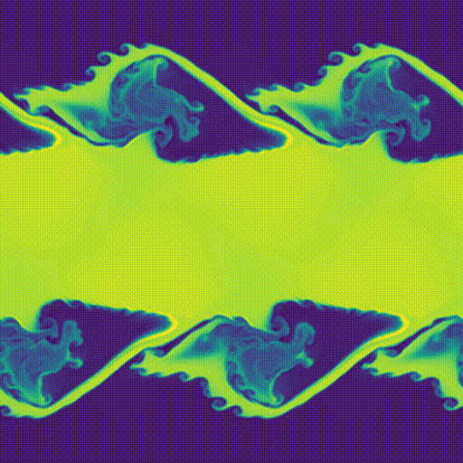

[](https://www.repostatus.org/#active)
[](https://www.python.org)
[](https://www.gnu.org/licenses/gpl-3.0)

<!--  -->

# astrea

**_astrea_** (**A**strophysical **S**hockwave and **T**urbulence **RE**search for interstellar **A**pplications) is a one-/two-dimensional (magneto-)hydrodynamics simulation toy model code for the purpose of modelling shockwaves in the interstellar medium, with possible implementation of a chemical network and radiative cooling.

**_This code is created as part of the Master's thesis research project at the University of Cologne, under supervision by Prof. Dr. Stefanie Walch-Gassner._**

<p align='center'>
  
  
  
</p>

# Description

### Code

The simulation employs a higher-order finite volume subgrid model (Eulerian) with a fixed and uniform Cartesian grid with periodic or outlet boundary conditions. The solution in the grid is updated in parallel. The simulation also allows for magnetic fields with the magnetic permeability set to one for simplicity.

The code is written entirely in Python 3, and uses the `numpy` and `h5py` modules extensively for calculations and data handling respectively. The last _stable^_ Python version supported is _**Python 3.12**_.

Some experimentation was done to parallelise the code with `Open MPI` and `MPICH`, or to enable multithreading. However, this is generally not recommended because of the global-interpreter-lock (GIL) in Python and the sequential nature of the simulation. Futhermore, `numpy` should already use multi-threading _wherever possible_, and 'parallelised Python' with `numpy` does not show a substantial increase in speed anyway over 'fully-parallel' code in Fortran or C (Ross, 2016).

^_There are some issues with building the wheels for `h5py` and `scipy` in Python 3.13 with the GIL disabled and experimental JIT compiler enabled (see [here](https://github.com/h5py/h5py/issues/2475) and [here](https://docs.scipy.org/doc/scipy/dev/toolchain.html)). Therefore, the code can only run with Python 3.13 built **without** those two options._

### Spatial discretisation

The space in the simulation is discretised into a uniform Cartesian grid, and thus the computational domain is assumed to be identically mapped to the physical domain.

The code employs various reconstruction methods with _primitive variables_ as part of the subgrid modelling: the piecewise constant method (PCM) (Godunov, 1959), the piecewise linear method (PLM) (Derigs et al., 2018), the piecewise parabolic method (PPM) (Felker & Stone, 2018), and the WENO method (Shu, 2009; San & Kara, 2015).

Godunov's theorem states that for a linear scheme that is monotonicity-preserving (i.e. do not produce spurrious oscillations), the scheme can be at most first-order accurate (Godunov, 1954). This has led to the development of several subgrid models that reduce these spurious oscillations while still maintaining a high-order accuracy. These models are known as Total Variation Diminishing (TVD) schemes (Harten, 1983). In order to fulfil the TVD condition, limiters have to be used after the spatial reconstructions. The PCM does not require any limiters. The PLM employs the "minmod" slope limiter (Derigs et al., 2018). The PPM employs several limiters: when _interpolating_ from the cell centres to the interfaces (Colella et al., 2011) and when _extrapolating_ to the left and right of each cell interface (Colella et al., 2011; McCorquodale & Colella, 2011). The WENO method currently does not employ any limiters. There are other TVD slope limiters available in the code too (e.g., superbee).

The parabolic reconstruction method by McCorquodale & Colella (2011) also allows for a slope flattener (Colella, 1990) and artificial viscosity as additional dissipation mechanisms to suppress oscillations at sharp discontinuities.

### Riemann solver and flux update

Due to the nature of the finite volume method and the discretisation of space in the grid, a Riemann problem is created at each interface between consecutive cells, with each cell containing the subgrid profile. In this code, approximate Riemann solvers are used (linear and non-linear) in order to compute the flux across interfaces.

The Local Lax-Friedrichs (LLF) solver (LeVeque, 1992) is an approximate linearised Riemann solver (i.e. the method aims to find an exact solution to the _linearised_ or _approximate_ version of the (magneto-)hydrodynamic equations). This scheme is very stable and robust, however it is highly dissipative and only first-order accurate. The code also allows for the Lax-Wendroff scheme (Lax & Wendroff, 1960), which is another approximate linearised Riemann solver and is second-order accurate. The Beam-Warming scheme (Beam & Warming, 1976) and the Fromm scheme (Fromm, 1968) are not included in this code as modifications to the update steps are required to adapt to those schemes.

The fluxes are calculated from the interpolated interfaces, and the Jacobian matrices are calculated from the Roe average of these interfaces (Roe & Pike, 1984; Cargo & Gallice, 1997).

Non-linear approximate Riemann solvers may also be used instead of linear solvers. Non-linear solvers tackle the non-linear form of the compressible Euler equations directly, instead of linearising the equations first. These solvers attempt to restore some form of the eigenstructure of the characteristic waves, and they are useful as they contain all the information. Since the main focus of this project is simulating shockwaves, where large discontinuities and possible spurrious oscillations are present (similar to Gibbs phenomenon), non-linear approximate Riemann solvers are therefore implemented into the code too.

The Harten-Lax-van Leer-Contact (HLLC) Riemann solver (Toro et al., 1994; Fleischmann et. al., 2020) attempts to restore the contact discontinuity wave while tracing the rarefaction and shockwave (Riemann invariants), thus it provides a better resolution albeit with some dissipation. The HLLC Riemann solver crashes when magnetic fields are present. For that, the Harten-Lax-van Leer-discontinuities (HLLD) solver (Miyoshi & Kusano, 2005) should be used. The HLLD Riemann solver restores the magnetosonic and Alfvén waves, although this is not a complete Riemann solver; this implementation of the Riemann solver ignores the slow magnetosonic wave.

Riemann solvers that attempt to derive the flux from the full (_but not exact_) eigenstructure are also included in the code, such as the entropy-stable flux (Derigs et al., 2018) and the modified Osher-Solomon flux (Dumbser & Toro, 2011). However, these solvers are not as robust and stable, and run into errors frequently.

### Time discretisation

A method-of-lines approach is used for the temporal evolution of the simulation, thus the temporal component of the advection equation can be discretised and treated separately from the spatial component.

Higher-order temporal discretisation methods can be employed to match the higher-order spatial components used. These higher-order methods also need to fulfil the TVD condition, which leads to the use of strong-stability preserving (SSP) variants of the Runge-Kutta (RK) methods, denoted here as SSPRK. Some of the SSPRK variants use the "Shu-Osher representation" (Shu & Osher, 1988) of Butcher's tableau of RK coefficients (Butcher, 1975).

In the following, the (explicit) SSPRK methods are denoted as SSPRK (_i_,_j_), where _i_ and _j_ refers to _i_-stage and the _j_-th order iterative method respectively. Several SSPRK variants are included for this simulation, with the SSPRK (2,2) (Gottlieb et al., 2009), SSPRK (3,3) (Shu & Osher, 1988; Gottlieb et al., 2009), SSPRK(4,3), SSPRK (5,3) (Spiteri & Ruuth, 2002; Gottlieb et al., 2009), SSPRK (5,4) (Kraaijevanger, 1991; Ruuth & Spiteri, 2002), and low-storage (Williamson, 1980) SSPRK(10,4) (Ketcheson, 2008) methods. The ''classic'' RK4 or the Forward Euler method can also be used.

For a _j_-order reconstruction scheme, _j_ > 4, the Dormand-Prince 8(7) (Dormand & Prince, 1981) method can be considered. However, this method is not a SSP variant as no methods with order _j_ > 4 with positive SSP coefficients can exist (Kraaijevanger, 1991; Ruuth & Spiteri, 2002), and therefore might not be suitable for solutions with discontinuities.

### Hydrodynamical tests

Several (magneto)hydrodynamical tests are in place:

- Hydrodynamics
  - Sod shock-tube test (Sod, 1978)
  - Sedov blast test (Sedov, 1946)
  - Shu-Osher shockwave test (Shu & Osher, 1988)
  - "Toro tests" (Toro, 1999, p.225)
  - "Lax-Liu tests" (Lax & Liu, 1998)
  - Slow-moving shockwave (Zingale, 2023, p.148)
  - Kelvin-Helmholtz instability
  - Simple advection wave tests
    - Gaussian
    - sine
    - square
    - isentropic vortex (Yee et al., 1999)
- Magnetohydrodynamics (_2D not stable_)
  - Ryu-Jones 2a shockwave test (Ryu & Jones, 1995)
  - Brio-Wu shockwave test (Brio & Wu, 1988)
  - Orszag-Tang test (Orszag & Tang, 1998)
  - MHD rotor (Balsara & Spicer, 1999)
  - MHD blast wave (Felker & Stone, 2018)

Analytical solutions for the Sod shock-tube test (Pfrommer et al., 2006), Gaussian wave test and the sine wave test are overplotted in the saved plots. The solution error norms are also calculated when the smooth advection wave tests are run (Gaussian & sine waves).

# Installation

_It is recommended to run Python projects in separate virtual environments._

Clone this repository onto your local machine, and navigate to the cloned repository. In the command line, run _`/path/to/venv/bin/python3 -m pip install .`_; this will install the minimum packages to run the simulation and create a `parameters.yml` file for simulation configurations.

# Usage

The main method to run the simulation would be to edit the simulation parameters in `parameters.yml` and running the main Python file:

```bash
python3 astrea.py
```

OR

```bash
./astrea.py
```

Alternatively, the code can be run with CLI options:

```bash
python3 astrea.py --config=sedov --cells=256
```

See _`--help`_ for a list of available options.

_Running the code in a Python interactive shell is also possible, although this is generally not recommended:_

```python
import astrea
astrea.run()
```

# Organisation

```
├── LICENSE
├── README.md
├── __init__.py
├── astrea.py            : Runs the simulation, and contains the update loop
├── functions
│   ├── __init__.py
│   ├── analytic.py      : Analytical solutions to (magneto)hydrodynamics tests
│   ├── constructors.py  : Constructors for math objects, such as eigenvectors and Jacobian matrices
│   ├── fv.py            : Frequently used functions specific to FVM
│   ├── generic.py       : Generic functions not specific to FVM
│   └── plotting.py      : Functions for (live-)plotting
├── num_methods
│   ├── __init__.py
│   ├── evolvers.py      : Collates the schemes for space and time evolution
│   ├── limiters.py      : Implements flux/slope limiters in the reconstructed states
│   ├── mag_field.py     : Functions for magnetic componenets computation (currently not stable)
│   ├── solvers.py       : Contains the Riemann solvers
├── parameters.yml       : Parameters for the simulation
├── schemes
│   ├── __init__.py
│   ├── pcm.py           : Piecewise constant method [Godunov, 1959]
│   ├── plm.py           : Piecewise linear method [Derigs et al., 2018]
│   ├── ppm.py           : Piecewise parabolic method [McCorquodale & Colella, 2011; Felker & Stone, 2015]
│   ├── weno.py          : WENO method [Shu, 2009; San & Kara, 2015]
├── setup.py             : Installation script
├── static
│   ├── __init__.py
│   ├── .db.json         : Database for parameters
│   ├── .default.yml     : Default parameters file
│   ├── .env             : Environment file
│   ├── requirements.txt : Full Python package requirements
│   ├── tests.py         : Initial conditions for (magneto)hydrodynamics tests
```


## References

1. Balsara, D. S., & Spicer, D. S. (1999). A Staggered Mesh Algorithm Using High Order Godunov Fluxes to Ensure Solenoidal Magnetic Fields in Magnetohydrodynamic Simulations. Journal of Computational Physics, 149, 270–292.
2. Beam, R. M., & Warming, R. F. (1976). An implicit finite-difference algorithm for hyperbolic systems in conservation-law form. Journal of Computational Physics, 22(1), 87-110.
3. Brio, M., & Wu, C. C. (1988). An upwind differencing scheme for the equations of ideal magnetohydrodynamics. Journal of Computational Physics, 75(2), 400–422.
4. Butcher, J. C. (1975). A stability property of implicit Runge-Kutta methods. BIT, 15(4), 358–361.
5. Cargo, P., & Gallice, G. (1997). Roe Matrices for Ideal MHD and Systematic Construction of Roe Matrices for Systems of Conservation Laws. Journal of Computational Physics, 136(2), 446–466.
6. Colella, P., Dorr, M. R., Hittinger, J. A. F., & Martin, D. F. (2011). High-order, finite-volume methods in mapped coordinates. Journal of Computational Physics, 230(8), 2952–2976.
7. Derigs, D., Gassner, G. J., Walch, S., & Winters, A. R. (2017). Entropy Stable Finite Volume Approximations for Ideal Magnetohydrodynamics (arXiv:1708.03537). arXiv.
8. Dumbser, M., & Toro, E. F. (2011). A Simple Extension of the Osher Riemann Solver to Non-conservative Hyperbolic Systems. Journal of Scientific Computing, 48(1–3), 70–88.
9. Felker, K. G., & Stone, J. (2018). A fourth-order accurate finite volume method for ideal MHD via upwind constrained transport. Journal of Computational Physics, 375, 1365–1400.
10. Fleischmann, N., Adami, S., & Adams, N. A. (2020). A shock-stable modification of the HLLC Riemann solver with reduced numerical dissipation. Journal of Computational Physics, 423, 109762.
11. Fromm, J. E. (1968). A method for reducing dispersion in convective difference schemes. Journal of Computational Physics, 3, 176.
12. Godunov, S. K. (1959). A Difference Scheme for Numerical Solution of Discontinuous Solution of Hydrodynamic Equations. Mat. Sbornik, 47, 271-306. Translated US Joint Publ. Res. Service, JPRS 7226, 1969
13. Gottlieb, S., Ketcheson, D. I., & Shu, C.-W. (2009). High Order Strong Stability Preserving Time Discretizations. Journal of Scientific Computing, 38(3), 251–289.
14. Harten, A. (1983). High Resolution Schemes for Hyperbolic Conservation Laws. Journal of Computational Physics, 49(3), 357–393.
15. Ketcheson, D. I. (2008). Highly Efficient Strong Stability-Preserving Runge–Kutta Methods with Low-Storage Implementations. SIAM Journal on Scientific Computing, 30(4), 2113–2136.
16. Kraaijevanger, J. F. B. M. (1991). Contractivity of Runge-Kutta methods. BIT, 31(3), 482–528.
17. Lax, P. D., & Wendroff B. (1960). Systems of conservation laws. Commun. Pure Appl. Math. 13 (2), 217–237.
18. Lax, P. D., & Liu, X.-D. (1998). Solution of Two-Dimensional Riemann Problems of Gas Dynamics by Positive Schemes. SIAM Journal on Scientific Computing, 19(2), 319–340.
19. LeVeque, R. J. (1992). Numerical Methods for Conservation Laws (2nd ed.). Birkhäuser Basel.
20. McCorquodale, P., & Colella, P. (2011). A high-order finite-volume method for conservation laws on locally refined grids. Communications in Applied Mathematics and Computational Science, 6(1), 1–25.
21. Miyoshi, T., & Kusano, K. (2005). A multi-state HLL approximate Riemann solver for ideal magnetohydrodynamics. Journal of Computational Physics, 208(1), 315–344.
22. Orszag, S. A., & Tang, C.-M. (1979). Small-scale structure of two-dimensional magnetohydrodynamic turbulence. Journal of Fluid Mechanics, 90, 129-143.
23. Pfrommer, C., Springel, V., Ensslin, T. A., & Jubelgas, M. (2006). Detecting shock waves in cosmological smoothed particle hydrodynamics simulations. Monthly Notices of the Royal Astronomical Society, 367(1), 113–131.
24. Prince, P. J., & Dormand, J. R. (1981). High order embedded Runge-Kutta formulae. Journal of Computational and Applied Mathematics, 7(1), 67–75.
25. Roe, P., & Pike, J. (1984). Efficient Conservation and Utilisation of Approximate Riemann Solution. Computing Methods in Applied Science and Engineering, 6, pp. 499-558.
26. Ryu, D., & Jones, T. W. (1995). Numerical magetohydrodynamics in astrophysics: Algorithm and tests for one-dimensional flow. The Astrophysical Journal, 442, 228.
27. San, O., & Kara, K. (2015). Evaluation of Riemann flux solvers for WENO reconstruction schemes: Kelvin–Helmholtz instability. Computers & Fluids, 117, 24–41.
28. Sedov, L. I. (1946). Propagation of strong shock waves. Journal of Applied Mathematics and Mechanics, 10, 241-250.
29. Sod, G. A. (1978). A survey of several finite difference methods for systems of nonlinear hyperbolic conservation laws. Journal of Computational Physics, 27(1), 1-31.
30. Shu, C.-W., & Osher, S. (1988). Efficient implementation of essentially non-oscillatory shock-capturing schemes. Journal of Computational Physics, 77(2), 439–471.
31. Shu, F. (1991). Physics of Astrophysics, Vol. II: Gas Dynamics. New York: University Science Books.
32. Shu, C.-W. (2009). High Order Weighted Essentially Nonoscillatory Schemes for Convection Dominated Problems. SIAM Review, 51(1), 82–126.
33. Spiteri, R. J., & Ruuth, S. J. (2002). A New Class of Optimal High-Order Strong-Stability-Preserving Time Discretization Methods. SIAM Journal on Numerical Analysis, 40(2), 469–491.
34. Toro, E.F., Spruce, M., & Speares, W. (1994). Restoration of the Contact Surface in the HLL Riemann Solver. Shock Waves, 4, 25-34.
35. Williamson, J. H. (1980). Low-storage Runge-Kutta schemes. Journal of Computational Physics, 35(1), 48–56.
36. Yee, H-C., Sandham, N., & Djomehri, M., (1999). Low dissipative high order shock-capturing methods using characteristic-based filters. Journal of Computational Physics, 150(1), 199-238.
